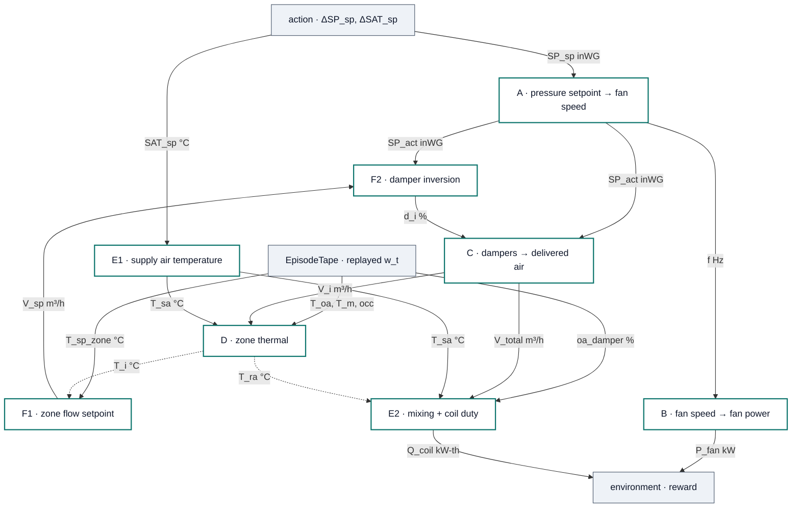

# Global UML — the physical means that link Blocks A–F

> **What this is.** One component diagram of the whole surrogate, in which every arrow carries the
> physical quantity that actually crosses it, with its symbol, unit and shape.
>
> Four documents already describe parts of this machine and none of them describes this relation:
> [hvac-system-logical-flow.md](hvac-system-logical-flow.md) §1 draws the **real plant** but never
> mentions the blocks; [grey-box-surrogate.md](grey-box-surrogate.md) §1.1 draws the **block order**
> but labels nodes with section references rather than with what passes between them;
> [src/floor8/README.md](src/floor8/README.md) §1 draws the **software layering**, which is a
> different relation again; and each `block-*-derivation/README.md` documents **one** block in
> isolation. This file is the assembly.
>
> **The authority is [src/floor8/plant/step.py](src/floor8/plant/step.py).** Every edge below is a
> call in that function. Where this document and a prose spec disagree, `step.py` wins — see §5.

---

## 0. How to read the diagram

Two conventions, both deliberate departures worth naming up front.

**This file introduces mermaid to a repo that has none.** Every other diagram here is Unicode
box-drawing inside a plain fence (`hvac-system-logical-flow.md:16`, `grey-box-surrogate.md:62`,
`src/floor8/README.md:33`, `step.py:13`). That style is right for a chain; this graph has twenty-odd
labelled edges and four boundary sources, and ASCII cannot carry the labels. It renders in GitHub
and in VS Code's markdown preview with no toolchain.

**Mermaid has no native UML component diagram**, so this is a `flowchart` carrying component
semantics:

| Notation | Means |
|---|---|
| teal box | a **block** — one derivation folder, one pure function in `plant/blocks.py` |
| grey box | a **boundary** — replayed data, the agent's action, or the environment |
| solid arrow, labelled `symbol unit` | a **physical quantity** crossing within one step |
| dashed arrow | a **state carry** — the value is read at the start of the *next* step |

**The diagram carries shape, not detail.** Each block's governing equation and fitted parameters are
in §2; each quantity's array shape and the BMS point behind it are in §3. That split is deliberate —
a picture that also tried to be the reference table was unreadable as either.

Airflow is **m³/h** throughout, temperatures **°C**, pressure **inWG**, power **kW**, frequency
**Hz**. §3.1 explains why that sentence needs saying.

---

## 1. The global component diagram

**The only cycle crosses a step boundary.** `F1 → F2 → C → D → F1` is a real closed loop — zone
warms, damper opens, air arrives, zone cools — but D's output is consumed on the *next* step, so
within a step the graph is a DAG. That is what makes the model non-circular, and it is the one
structural claim the picture has to make on its own, which is why those two edges stay drawn.

Both dashed edges carry the **same** value: `state.T_i`, the temperature at the start of the step.
F1 reads it before D runs and E2 reads it after, but E2 takes it from the state rather than from
`T_next`, so the two are identical and neither is same-step feedback. E2's position *after* D in the
execution order is therefore not a data dependency — it is just where §1.1 put it.

### 1.1 Three things deliberately not drawn

Each was in an earlier version of this diagram and each cost more in clutter than it bought.

**`fan_on` gates four blocks.** When false, A zeroes `f` and `SP_act`, C holds `d_i` at its previous
value and delivers nothing, B zeroes `P_fan`, and E2 zeroes `Q`. Drawn, it is four long edges
crossing the graph to say one thing. The agent cannot write it — `ahu_b8_1__status_write` is
constant 0 while `status_read` shows the unit running, so the schedule is replayed and the action
space is setpoint trim only ([hvac-system-logical-flow.md](hvac-system-logical-flow.md) §5).

**E1's valve port has no producer** — §4.3. Absence is a fact about the graph, not an element in it.

**F2 reads its own previous damper position** (`d = d_now + λ·(d_want − d_now)`). A self-loop renders
badly and the blend is already stated in §2's equation column.

---

## 2. Port table

Required and provided interfaces, one row per component, 1:1 with the signatures in
[src/floor8/plant/blocks.py](src/floor8/plant/blocks.py).

| Component | Function | Required (← producer) | Provided |
|---|---|---|---|
| **E1** | `supply_air_temperature` | `sat_sp` ← action · `valve_proxy` ← **nothing** · `noise` ← env | `T_sa` (2,) °C |
| **F1** | `zone_flow_setpoint` | `T_i` ← D *(prev step)* · `T_sp` ← tape · `v_min`, `v_max` ← params | `V_sp` (53,) m³/h |
| **A** | `required_frequency_and_achieved_sp` | `sp_sp` ← action · `fan_on` ← tape | `f` (2,) Hz · `SP_act` (2,) inWG · `sp_shortfall` (2,) inWG |
| **F2** | `zone_dampers` → `dampers_for_targets` | `v_sp` ← F1 · `sp_act` ← A · `d_now` ← F2 *(prev step)* · `a_i, ln_C, q, s, p` ← C's params | `d_i` (53,) % |
| **C** | `deliver` (`split_weights`) | `d_i` ← F2 · `sp_act` ← A | `V_i` (53,) m³/h · `V_total` (2,) m³/h |
| **B** | `fan_power` | `f` ← A · `fan_on` ← tape | `P_fan` (2,) kW |
| **D** | `zone_step` | `T_i` ← self *(prev step)* · `V_i` ← C · `T_sa` ← E1 *(2 AHU values fanned to 53 boxes via `ahu_of_box`)* · `T_m`, `T_oa`, `occ` ← tape | `T_i(t+1)` (53,) °C |
| **E2** | `mixed_air` → `coil_duty` | `T_ra` ← D *(start of step)* · `T_oa`, `oa_damper` ← tape · `V_total` ← C · `T_sa` ← E1 | `T_ma` (2,) °C · `φ` (2,) · `Q_coil_kw` (2,) kW-th |

### 2.1 What each block computes

The equations and fitted values, kept out of the diagram so it stays legible. Values are AHU-1 /
AHU-2, from `report/rl/params.json`.

| Block | Equation | Parameters |
|---|---|---|
| **E1** | `T_sa = SAT_sp + b0 + b1·valve + η` | `b0` = −1.241 / −0.320 · `σ` = 1.79 / 2.38 K · **`b1` = 0** (§4.3) |
| **F1** | `V_sp = clip(A_i + G_i·(T_i − T_sp_i), v_min, v_max)` — a **level**, not an increment | `G` median 12.87 / 32.17 · `A` median 235 / 238 |
| **A** | `f = f_ref·(SP_act/SP_ref)^β`, capped at 50 Hz; below the cap `SP_act = SP_sp` | `β` = 0.382 / 0.232 — a **reduced-form** elasticity · `f_ref` = 35.65 / 35.50 · `SP_ref` = 0.55 / 0.60 |
| **F2** | `d = d_now + λ·(C⁻¹(V_sp, SP_act) − d_now)` — the closed-form inverse of C | `λ` = 1.0 default; **not fitted**, a DR axis |
| **C** | split `V_i = V_total · a_i·d_i^p / Σ a_j·d_j^p` · total `V_total = C·(Σ a_j·d_j^p)^q · SP_act^s` | `ln_C` = 5.621 / 3.072 · `q` = 0.886 / 1.501 · `s` = 0.512 / 0.724 · `p` = 1 (imposed) |
| **B** | `P_fan = a + b·(f/50)³` | `a` = 1.097 / 0.496 · `b` = 5.083 / 6.796 (`offset_cubic`, `analysis` mask) |
| **D** | `ΔT_i = k(T_m−T_i) + a·V_i(T_sa−T_i) + g(T_oa−T_i) + δ·occ + c` | per box (53 each); `k, a, g` **already carry** dt = 0.25 h · `g` = 0 on 43 of the 53 shipped boxes (41 of the 51 Block D fitted) |
| **E2** | `T_ma = φ·T_oa + (1−φ)·T_ra`, `φ = clip(φ0 + φ1·oa_damper, 0, 1)` · `Q = ρcp·V_total·(T_ma − T_sa)` | `φ0` = 1.729 / 1.212 · `φ1` = **−0.0179 / −0.0132** (wrong sign, §4.7) · `ρcp` = 1.21 |

`sp_shortfall = max(SP_sp − SP_act, 0)` and `sfp = P_fan / V_total` are diagnostics rather than
physical flows, so they leave the plant through `Diagnostics` and are not drawn. The reward is
`−(E_fan_kwh + Q_coil_kwh_th / COP) − λ_move·move`: **COP is applied at the environment boundary**,
never inside Block E — coil duty stays thermal throughout the plant, because no chiller COP exists
in this dataset.

**Closure.** Every required port above has exactly one producer, except `valve_proxy`, which has
none and is listed in §4. This is the same property falsifier 1 asserts in
[scripts/verify_env.py](scripts/verify_env.py) — and it exists because `d_i`, `valve(t)` and `T_ra`
were all once consumed by the §1.1 step order with nothing producing them.

---

## 3. Signal dictionary

| Symbol | Unit | Shape | Produced by | Consumed by | Measured point |
|---|---|---|---|---|---|
| `SP_sp` | inWG | (2,) | action | A | `ahu_b8_*__static_pressure_setpoint_read` |
| `SP_act` | inWG | (2,) | A | F2, C | `ahu_b8_*__static_pressure` |
| `SAT_sp` | °C | (2,) | action | E1 | `ahu_b8_*__supply_air_temperature_setpoint_read` |
| `T_sa` | °C | (2,) | E1 | D, E2 | `ahu_b8_*__supply_air_temperature` |
| `f` | Hz | (2,) | A | B | `ahu_b8_*__frequency` |
| `P_fan` | kW | (2,) | B | env | `ahu_b8_*__power` |
| `V_sp` | m³/h | (53,) | F1 | F2 | **not logged** — see §4.6 |
| `d_i` | % | (53,) | F2 | C | `vav_8_*__damper_position` |
| `V_i` | m³/h | (53,) | C | D | `vav_8_*__air_flow_rate` |
| `V_total` | m³/h | (2,) | C | E2 | Σ of the above |
| `T_i` | °C | (53,) | D | F1, E2 (`T_ra`), comfort | `vav_8_*__room_temperature` |
| `T_sp_zone` | °C | (53,) | tape | F1, comfort | `vav_8_*__room_temperature_setpoint_read` |
| `T_m` | °C | (53,) | tape | D | 21:00–05:59 plateau mean, per zone per night |
| `T_oa` | °C | scalar | tape | D, E2 | `outdoor_weather_station__drybulb_temperature` |
| `occ` | 0–1 | scalar | tape | D | mean of `floor_8_zone_*__pir` |
| `oa_damper` | % | (2,) | tape | E2 | `ahu_b8_*__fresh_air_damper_position_read` |
| `fan_on` | bool | (2,) | tape | A, B, C, E2 | `ahu_b8_*__frequency > 5 Hz` |
| `T_ma` | °C | (2,) | E2 | E2 | **not measured** — inferred |
| `Q_coil_kw` | kW-**thermal** | (2,) | E2 | env | `ahu_b8_*__cooling_rate` |

### 3.1 Units are mixed on the same device, and the diagram's labels are the guard

Room and supply air temperature are **°C**; outdoor drybulb and *every* water-circuit temperature
are **°F**, converted on load in [src/floor8/tape.py](src/floor8/tape.py) per block-e §5. Duct static
is inWG, valve flow L/min, cooling rate kW-thermal, damper and valve %.

Airflow is **m³/h**, and that was not free: block-e §8 discriminated it against CFM and L/s by a
margin of 25.0× / 16.5×, answering the question block-c §4.6 could not — block-c's own ratios are
unit-invariant, so the unit hid inside its scale constant `C`. Block D's `a_i` and Block F's `G`
carry the same unit, and are invariant only so long as fit and rollout agree on it.

### 3.2 Symbol collisions to watch

Four symbols mean different things in different blocks. The diagram disambiguates by component;
prose should name the block.

| Symbol | In | Means |
|---|---|---|
| `a_i` | C | per-room relative authority, Σ = 1, dimensionless |
| `a_i` | D | supply-air advection coefficient, carries dt and 1/C_i |
| `a`, `b` | B | fan-curve offset and cube coefficient, kW |
| `A` | F | the zone controller's flow *level*, m³/h — not Block A |
| `d_i` | F → C | **VAV** damper position |
| `oa_damper` | tape → E2 | **AHU fresh-air** damper position |

---

## 4. The edges that deliberately do not exist

This is the half of the graph that is easiest to draw wrong.

**4.1 — C does not feed A, and A does not feed C.** `β` is a *reduced-form* elasticity measured from
the plant's own setpoint episodes; it already contains the damper response. Wiring C into A would
double-count it. They are two projections of one physical event — A gives fan speed, C gives
delivered air — and `sfp = P_fan / V_total` is the consistency test that keeps them honest precisely
because they are computed independently (`step.py:24-27`; block-a §2 adds that A's exponent and C's
flow loss "must never be tuned independently").

**4.2 — F2 does not consume delivered air.** Stage 2 needs only `SP_act`, which comes from A, which
needs only the *setpoint*. So `SP_sp → (f, SP_act) → d_i → V_i` runs one way and Block C's output
never returns to Block A (`step.py:29-31`).

**4.3 — The cooling valve has no producer.** Block E's own regressor is valve position, which no
block produces and which block-e §5 therefore rules unsimulable. Of the admissible simulable
alternatives none beat a constant bias by enough to justify the endogeneity, so `b1` ships at `(0, 0)`
and E1 is a constant per-AHU bias plus noise. The port is drawn and marked rather than omitted,
because omitting it is how it went unnoticed the first time.

**4.4 — `d_i` is not `oa_damper`.** The VAV damper is produced by F2 and consumed by C; the AHU
fresh-air damper is replayed from the record and consumed only by `mixed_air`. Two ports, two
colours, no edge between them.

**4.5 — `T_ra` is read at the start of the step**, before D updates the zones — causally prior, not
same-step feedback (`step.py:126-128`, honouring block-e §5's ordering caveat).

**4.6 — `V_sp` is not a logged point.** A VAV box logs seven points and the commanded flow setpoint
is not among them, so §7's original identification recipe regressed on an unobservable. The shipped
stage-1 form is a **level**, not an increment: the increment form is sub-Nyquist at 15 minutes *and*
returns the wrong sign on 18 of 19 AHU-1 zones (block-f §2.3).

**4.7 — The weakest edge in the graph is E2's mixing map.** `φ1` is **negative** on both AHUs
(−0.0179 / −0.0132), which has no physical reading — a more open damper should admit more outside
air. `blocks.py` clips `φ` to [0, 1] to keep the mixing physical and reports the defect rather than
repairing it. The SAT setpoint gain is likewise unsettled across five estimators (0.91–3.02). Treat
anything downstream of E2 as a band, not a number.

---

## 5. Execution order

The order is part of the specification, because it is what stops the model being circular.

| # | Node | Computes |
|---|---|---|
| 0 | — | rate-limit the action, clip to the logged support → `SP_sp`, `SAT_sp` |
| 1 | **E1** | `T_sa` |
| 2 | **F1** | `V_sp` |
| 3 | **A** | `f`, `SP_act` — and §4.4's shortfall if the fan cannot make pressure |
| 4 | **F2** | `d_i` |
| 5 | **C** | `V_i`, `V_total` |
| 6 | **B** | `P_fan` |
| 7 | **D** | `T_i(t+1)` |
| 8 | **E2** | `T_ra`, `T_ma`, `φ`, `Q_coil` |

Pressure cancels from C's split — it is common to every box at a step, so it divides away — which is
why `Σ V_i = V_total` holds to floating point rather than approximately (falsifier 5, 4.2e−16).

> **CORRECTED.** [grey-box-surrogate.md](grey-box-surrogate.md) §1.1 places **F2 before A**
> (E1 → F1 → F2 → C → A → B → D → E2). That order cannot run: stage 2 needs `SP_act`, and `SP_act`
> is Block A's output. [src/floor8/plant/step.py](src/floor8/plant/step.py) runs **A before F2**, and
> the diagram above follows `step.py`. The spec's order is recorded here rather than edited there,
> following the convention block-c §9.1 set for consequences that land in another document.

---

## 6. The other graph — derivation-time dependencies

A second set of links exists between these blocks, and conflating it with §1 is its own error: these
are **parameter-provenance** edges, not physical flows. Nothing here happens at runtime.

| Edge | What crosses |
|---|---|
| A ↔ B | one derivation read from opposite ends — `d lnP/d lnSP = 3·β`, giving 1.145 against 1.130 measured (1.3%) |
| E → C | block-e §8 discriminates the airflow unit (m³/h) that block-c §4.6 could not, because block-c's ratios are unit-invariant |
| C → D | per-room flow error (median 5.4% / 9.2%) propagates into D **at rollout, not at fit** — stage 2 regresses on *logged* `V_i` |
| C → F | F imports C's forward model via importlib — "one forward model, two consumers". Falsifier 11 is that seam, and it caught a real 0.36-damper-point disagreement |
| C → F | F reproduces `block-c-derivation/data/pressure_cut_counterfactual.csv` at both λ endpoints as a guard |
| B → E | block-e scales fan heat with Block B's offset cubic; logged 2.90 / 2.94 kW against B's 2.97 / 3.01 kW |

Two provenance facts belong on the components themselves:

- **Blocks A and B are not reproduced in this tree.** Their `data/*.csv` were produced elsewhere;
  `provenance_table()` marks them `NOT reproduced here` and `train_sac.py` prints it. C, D, E and F
  reproduce in-tree.
- **15 of 53 boxes carry imputed or pooled parameters.** Each block excluded what would have
  corrupted *it* (C fits 48 of 53, D fits 51, F identifies 41), but a simulator cannot inherit those
  exclusions — a starved zone is still a zone. `box_provenance_table()` names them.

---

## 7. Checking this document against the code

It is meant to be falsifiable in the same way the blocks are.

1. **Edge completeness** — walk `step.py` top to bottom; every call appears as an edge in §1, and no
   edge in §1 lacks a call.
2. **Closure** — every arrowhead in §1 is a declared required port in §2, and every required port has
   exactly one producer or appears in §4. Mirrors falsifier 1.
3. **Parameter values** — every number in §1 and §2 cross-checks against `report/rl/params.json`, the
   frozen vector actually loaded at runtime.
4. **`python scripts/verify_env.py`** — the 11 falsifiers, which establish that the code this
   document describes is the code in its passing state.
